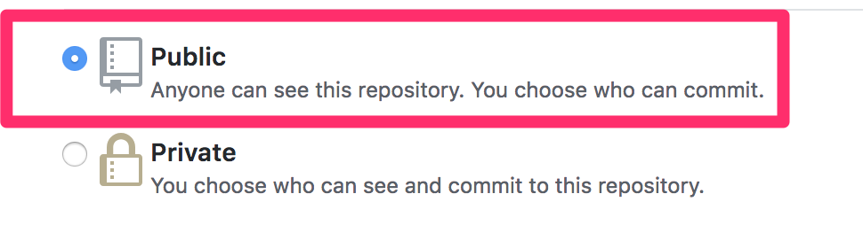

## Instructions to Publish homework on Github Pages

### Use instructions below as a reference to publish your homework via GitHub Pages. For addtional reference please also consult [https://pages.github.com/](https://pages.github.com/). Be sure to select the **Project Site** and **Start from Scratch** options for instructions

* First, create a new repository in GitHub.

  * Go to the GitHub website and create a new repository by clicking **New**.

  

  * The repository must be made public in order to be deployed to GitHub Pages.

  

  * Clone the repository by copying the URL and entering `git clone <url>` in the CLI.

  

* Next, push the project to GitHub.

  * Navigate to the directory of the repository.

  * Copy and paste the HTML, JavaScript, and JSON files from the Solved folder into the repository.

  * `git add .`

  * `git commit -m "<your message here>"`

  * `git push origin master`

* Next, go to the project page on GitHub and click on **Settings** to configure for deployment.

  

  * Under Settings, go to GitHub Pages and select **master branch**.

  

  * Click **Save**.

* The project should now be deployed to GitHub Pages.

  

  * The URL of the deployed page is `<account name>.github.io/<project name>`.

  * The deployment should be relatively quick but may take up to several minutes.
